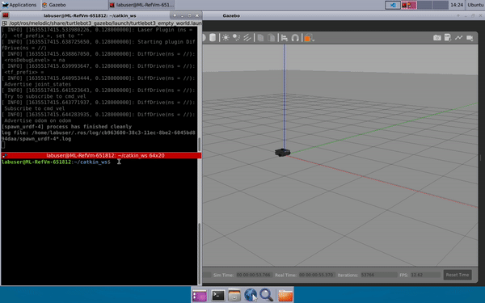
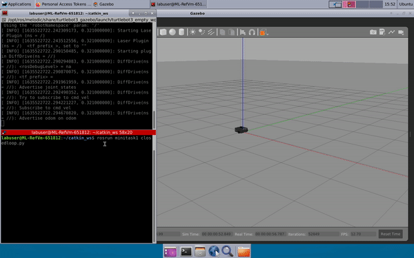

# Square Drawing Turtlebot in Gazebo

## Open Loop Implementation
- Robot going around in a square of 1m edge length, looping through drive forward a distance _d_ and rotate an angle _alpha_
- Robot trajectory is plotted after each iteration (each square drawn) by obtaining every (x,y) position through odometry callback
- Covariance matrix of final position (x,y) for each iteration is calculated

## Closed Loop Implementation
- Robot going around in a square of 1m edge length by passing a desired position and desired angle in each loop
- After each iteration, robot will self-orient 
- Robot trajectory is plotted after each iteration (each square drawn) by obtaining every (x,y) position through odometry callback
- Covariance matrix of final position (x,y) for each iteration is calculated

