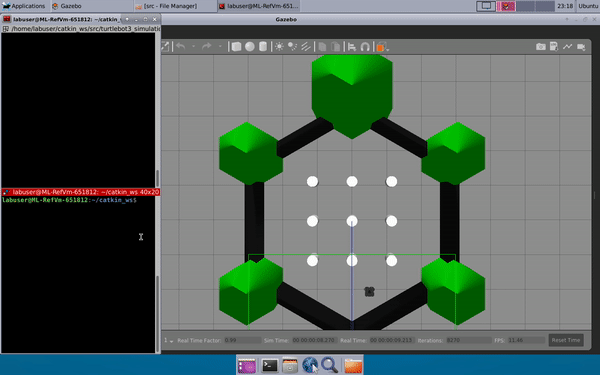

# Obstacle Avoidance and Random Walking

## Multiple Behaviours Robot
1. Obstacle Avoidance : When robot is faced with an obstacle closer than 0.5m within 45 degree angle of field, it will stops and rotate until there is no obstacle in close distance.
2. Random Walking : When there is no obstacle in close distance, the robot will perform random walking, where it moves forward for 3m, then randomly rotates into different direction and continues random walking.

- The code divides the front of the robot into 4 regions: left, front-left, front-right, right where only front-left and front-right are considered for detecting the presence of obstacles.
- Laser scan callback are used to return the estimated distance to the obstacle. If there is no obstacle within 3m range of scan, the simulation return inf.
- Output of the states of the robot will be printed:
  - random walking
  - random turning
  - front-left obstacle
  - front-right obstacle
  - front obstacle
  - unknown case

